# � OOH DIMENSION IMPLEMENTATION - COMPREHENSIVE CONTEXT

**Last Updated**: May 1, 2026  
**Branch**: `ooh_decompisition`  
**Status**: Ready for Code Review & Commit  

---

## 📋 Executive Summary

```mermaid
graph TB
    subgraph "Client Layer"
        FE["Frontend<br/>(React/Next.js)"]
        Mobile["Mobile Apps"]
        CliTools["CLI Tools"]
    end

    subgraph "API Gateway & Auth"
        FastAPI["FastAPI Server<br/>Port 8000"]
        CORS["CORS Middleware"]
        SecurityMW["Security Middleware<br/>(Rate Limiting, Validation)"]
        AuthMW["Auth Middleware<br/>(JWT, API Key)"]
    end

    subgraph "Authentication Layer"
        LegacyJWT["Legacy JWT<br/>(user_id only)"]
        OrgJWT["Org Module JWT<br/>(userId, orgId, role)"]
        APIKey["API Key Auth<br/>(HMAC-SHA256)"]
    end

    subgraph "Core Services"
        AuthService["Auth Service<br/>(Register, Login, JWT)"]
        StripeService["Stripe Manager<br/>(Checkout, Billing)"]
        CreditService["Credit System<br/>(Prepaid/Postpaid)"]
        ImageService["Image Pipeline<br/>(Transform/Generate)"]
        BillingService["Billing Service<br/>(Monthly Rollover)"]
    end

    subgraph "AI/Image Generation"
        Gemini["Google Gemini API<br/>Primary"]
        Vertex["Vertex AI<br/>Fallback 1"]
        OpenRouter["OpenRouter<br/>Fallback 2"]
        SeedDream["SeedDream 4.5<br/>Fallback 3"]
        Flux["Flux Schnell<br/>Fallback 4"]
    end

    subgraph "Payment Processing"
        Stripe["Stripe API<br/>(Payment Gateway)"]
        StripeWebhook["Webhook Handler<br/>(Subscriptions, Addons)"]
    end

    subgraph "Data Layer"
        MongoDB["MongoDB Atlas<br/>visual_engine DB"]
        UsersCol["users<br/>(auth, credits)"]
        PlansCol["plans<br/>(pricing)"]
        UsageCol["usage_logs"]
    end

    subgraph "Storage"
        DOSpaces["DigitalOcean Spaces<br/>(Image Storage)"]
    end

    subgraph "External Services"
        SMTP["SMTP Server<br/>(Gmail)"]
        OrgModule["Organisation Module<br/>(NestJS)"]
    end

    FE --> FastAPI
    Mobile --> FastAPI
    CliTools --> FastAPI
    
    FastAPI --> CORS
    CORS --> SecurityMW
    SecurityMW --> AuthMW
    
    AuthMW --> LegacyJWT
    AuthMW --> OrgJWT
    AuthMW --> APIKey
    
    AuthMW --> AuthService
    AuthMW --> StripeService
    AuthMW --> CreditService
    AuthMW --> ImageService
    
    AuthService --> MongoDB
    CreditService --> MongoDB
    ImageService --> MongoDB
    
    ImageService --> Gemini
    ImageService --> Vertex
    ImageService --> OpenRouter
    ImageService --> SeedDream
    ImageService --> Flux
    
    ImageService --> DOSpaces
    
    StripeService --> Stripe
    StripeWebhook --> StripeService
    StripeWebhook --> CreditService
    
    CreditService --> UsersCol
    AuthService --> UsersCol
    BillingService --> UsersCol
    
    AuthService --> SMTP
    BillingService --> SMTP
    
    OrgJWT -.-> OrgModule
    CreditService -.-> OrgModule

    style FastAPI fill:#4CAF50
    style MongoDB fill:#0D7377
    style Stripe fill:#635BFF
    style Gemini fill:#EA4335
    style DOSpaces fill:#0080FF
```

---

## 🏛️ Architecture Overview

- **Framework**: `FastAPI` (serving on port 8000 via `Uvicorn`).
- **Dual Engine Operations**:
  - `transformation`: Editing and resizing images.
  - `creation`: Generating new AI images from scratch.
- **Failover Concept**: Five-tier AI fallback (Gemini → Vertex → OpenRouter → SeedDream → Flux) for high availability during generation outages. 
- **Billing Strategy**: Handles **Prepaid** (Monthly packages) and **Postpaid** (Usage-based tracking with automatic end-of-month rollover tasks).

---

## 🔴 Critical Security Loopholes & Risks

1. **Hardcoded JWT Defaults (CRITICAL)** 
   If `JWT_SECRET` is missing from the `.env` file, the auth relies on a weak hardcoded key (`"your-secret-key-change-this-in-production"`). This permits complete authentication bypass from external attackers forging JWTs.
2. **Shared JWT Secret between Services (HIGH)**
   `org_auth.py` uses the exact same secret environment variable as the native JWT. If one service is compromised, both services succumb to vulnerability.
3. **API Key Shares the Same Secret (HIGH)**
   The API Key HMAC hashes use `SECRET_KEY`. If the JWT secret is exfiltrated, all API Keys can be easily brute-forced.
4. **Weak Stripe Webhook Validation (HIGH)**
   In `stripe_manager.py`, if `STRIPE_WEBHOOK_SECRET` is not set, a warning prints out, but it still **processes** the webhook event. Attackers could forge incoming webhook calls, granting themselves limitless credits and unauthorized premium subscriptions.
5. **No Password Reset Anti-Bruteforce Mechanism (MEDIUM)**
   The password reset tokens are checked continuously without tracking attempts, rate limiting, or exponential backoffs.
6. **No Proper Rate-Limiting for Distributed Systems (HIGH)**
   Rate limits are stored in a local `dict` inside memory. In a load-balanced production environment (multiple node workers), rate limiting won't synchronize across nodes, making the infrastructure trivial to DDoS attack.

---

## 🟠 Core Logic & Architectural Bugs

1. **Duplicate Credit Tracking causing Sync Issues (CRITICAL)**
   Credits are tracked in three separate document layers within MongoDB (e.g., legacy `units`, generic `credits`, and engine-specific credits `engine_data.transformation.credits`). If these variables get out of sync, customers could be overcharged or erroneously lose credits.
2. **Subscription Cancellation Race Conditions (CRITICAL)**
   The engine cancellation targets an arbitrary subscription ID if multiple remain active. A user with two active engines can cancel one and manipulate the endpoint to retain free access to the other engine logic.
3. **Postpaid Infinite Rollover Bug (HIGH)**
   In the consumption block (`auth.py`), postpaid increments `monthly_used` indefinitely. Without resetting usage periods to differentiate billing cycles, an uncaught rollover failure will bill the user recursively for historical usage.
4. **Permanent Addons without Expirations (MEDIUM)**
   Addon queries (`add_addon_credits`) do not initialize an `addon_expiry_date` boundary, allowing customers to hoard credits over years against standard business policies.
5. **Simultaneous Credit Reduction (Double-Spend) (MEDIUM)**
   Using standard updates without `$inc` on `remaining_to_deduct` opens race conditions when users hit endpoints concurrently. E.g., multiple rapid requests successfully deducting usage from the same initial remaining credit value state.

---

## � AI Hallucination & Dimensional Logic Bugs

1. **"Source-Dimension Blind" Prompt Generation (CRITICAL)**
   The AI (Gemini) hallucinates because it receives conflicting constraints. In functions like `build_image_adaptation_prompt`, the prompt generators use the *target dimensions* (`tw`, `th`) to decide whether to scale by width or height, ignoring the *source's original aspect ratio*. For example:
   - Resizing a 16:9 image to a 1:1 square forces a scale-to-height operation that creates a massive 177% width overflow.
   - The prompt then demands the AI "Extend background LEFT and RIGHT" on this already-overflowing canvas, resulting in immediate distortion, duplication (ghosting), and failure.
2. **Hardcoded Directions in OpenRouter Logic (HIGH)**
   In `build_openrouter_resize_prompt`, the prompt is hardcoded to *always* "scale to {th}px HEIGHT" and *always* "extend the LEFT and RIGHT edges," completely destroying the image integrity anytime a user converts a wide image into a portrait/square.
3. **Disconnected Geometric Fallbacks (MEDIUM)**
   Accurate geometric logic (e.g., verifying `if src_ar > tgt_ar * 1.2`) exists purely inside the bypassed `build_outpaint_prompt` fallback, meaning it completely fails to protect the main AI execution pathways.

---

## �🟡 Performance & Bad Practices

1. **Blocking Subprocesses in Async I/O (HIGH)**
   Standard blocking database lookups and SMTP logic (`send_password_reset_email`) are utilized directly on the central async event loop in `main.py` without threaded offloading. This can lock incoming HTTP requests for upwards of 5 seconds per caller.
2. **Monolithic Controller**
   The `main.py` file encompasses over thousands of lines. This structure breaks all separation-of-concerns principles (Auth, Payments, Processing, Admin). It's incredibly difficult to maintain logic in a monolithic route list.
3. **Single-Threaded Month-End Script Blocking Resource**
   The billing rollover task processes all customers identically per cycle on array iteration. Processing huge databases manually restricts all active API calls due to blocked CPU threads.
4. **Stack Traces pushed to Stdout**
   Error response traces directly push incoming HTTP body contents to print consoles. Passwords and keys submitted during validation errors will be globally visible in the logging containers.

---

## 🎯 Priority Remediation Roadmap

### Phase 1: CRITICAL
- Fix hardcoded JWT secrets (`JWT_SECRET` must be required).
- Implement strict webhook signature validation.
- Add database indexing for subscription queries.
- Implement Redis-based rate limiting.

### Phase 2: HIGH
- Refactor credit system (single source of truth structure for MongoDB references).
- Fix async/blocking I/O issues by utilizing `asyncio.to_thread()`.
- Add idempotency/lock checks to webhook processing instances.
- Implement audit logging.

### Phase 3: MEDIUM
- Add structured logging to replace `print()`.
- Split `main.py` into dedicated fastAPI routers (`routers/auth.py`, `routers/stripe.py`, `routers/image.py`).
- Implement pagination across fetching limits.
- Add standard health check endpoints.
## 🚀 Recent Implementations (May 1, 2026)

### OOH Banner Generation Pipeline Caching & S3 Sync
- **Local SHA-256 Fingerprinting:** Refactored `ooh_pipeline.py` to cryptographically hash `(file_hash = hashlib.sha256(image_bytes).hexdigest())` incoming images on a byte level. This entirely prevents API waste (double-charging) for duplicate images by loading from `ooh_decomposition_cache/` if available.
- **S3 Bucket Syncing (DigitalOcean Spaces):** Added `sync_cache_from_s3` and `sync_cache_to_s3` to `ooh_pipeline.py`. 
    - The server now queries `DO_SPACES_BUCKET_NAME` via `boto3` on cache misses, downloading decomposed assets rather than regenerating them.
    - If there is a complete cache miss across local and S3, it isolates the components and then silently backs up the finished component chunks and `components.json` directly to S3 `ooh_cache/{hash}/` to share with cluster instances and survive container rebuilds.
- **Auto TTL Garbage Collection:** Built `_cleanup_old_cache(max_age_hours=48)` to routinely expire and delete raw image decomposition cache to prevent local storage bloating.
- **Recomposition AI Locking:** Stamped firm constraints across all 20 layout profiles in `ooh_dimensions.py` enforcing strict adherence to source (`CRITICAL: Human faces, bodies, and clothing MUST remain 100% pixel-perfect`).
